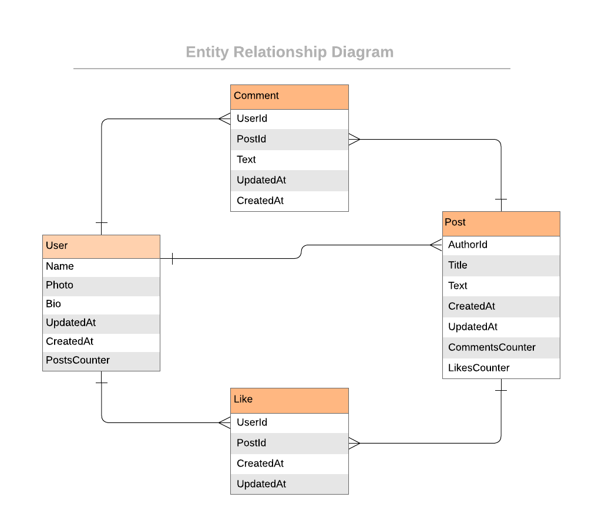

<!-- TABLE OF CONTENTS -->
# 📗 Table of Contents

- [📗 Table of Contents](#-table-of-contents)
- [📖 RubyOnRails-Blog](#-rubyonrails-blog)
    - [How to build the RubyOnRails-Blog app](#how-to-build-the-rubyonrails-blog-app)
    - [Projects list](#projects-list)
  - [🛠 Built With ](#-built-with-)
    - [Tech Stack ](#tech-stack-)
    - [Tools i have used for this project ](#tools-i-have-used-for-this-project-)
    - [Key Features ](#key-features-)
  - [💻 Getting Started ](#-getting-started-)
    - [Prerequisites](#prerequisites)
    - [Setup](#setup)
    - [Install](#install)
    - [Usage](#usage)
    - [Run tests](#run-tests)
    - [Deployment](#deployment)
  - [👥 Authors ](#-authors-)
  - [🔭 Future Features ](#-future-features-)
  - [🤝 Contributing ](#-contributing-)
  - [⭐️ Show your support ](#️-show-your-support-)
  - [🙏 Acknowledgments ](#-acknowledgments-)
  - [📝 License ](#-license-)

<!-- PROJECT DESCRIPTION -->
# 📖 RubyOnRails-Blog<a name="about-project"></a>
> The RubyOnRails-Blog app will be a classic example of a blog website. I will create a fully functional website that will display a list of posts and empower readers to interact with them by adding comments and liking posts.

<!-- > Describe your project in 1 or 2 sentences. -->
### How to build the RubyOnRails-Blog app

The end result should follow the following data model (this is an Entity Relationship Diagram):

<p align="center">
  
</p>

For this project I will have full freedom in terms of visual design but I will need to keep the following wireframes:

<p align="center">
  
  
  
</p>

<p align="center">
  
  
</p>

I will practice my knowledge about basic Ruby on Rails concepts - starting from the Views and finishing the database connection. I will also implement ideas like authentication, authorization, and all kinds of tests. In the last step, I will create an API instead of API consumption.

### Projects list
I will be building the RubyOnRails-Blog for three weeks. Here is the list of projects that will guide me through the steps described above. Please find details about each of the milestone requirements in the upcoming project activities.

- Project 1: Creating a data model.
  - Create a new rails app. (rails new app-name --database=postgresql)
  - add database credentials at config\database.yml
  - run `rails db:create`
  - Build project schema.
    - Create the necessary migration files.
      - `rails generate migration CreateUsers name:string photo:string bio:text posts_counter:integer`
      - `rails generate migration CreatePosts title:string text:text comments_counter:integer likes_counter:integer`
      - `rails generate migration CreateComments text:text`
      - `rails generate migration CreateLikes`
    - Run the necessary migration files.
      - `rails db:migrate`
    - Table and column names should match the ERD diagram.
      - note: photo for users table should be a link to an image
    - Foreign keys should be included.
      - Pay attention that in `posts` table the column holding the foreign key to the `users` table should be named `author_id`
    - All columns that are foreign keys should have a corresponding index.
  - Be sure to reference the from the ERD.
    <p align="center">
      
    </p>

- Project 2: Processing data in models
  - Create models
    - Create model classes for all entities as shown in the ERD diagram.
    - Set up associations between models.
      - Remember that author_id column in posts table should be the foreign_key for the users table.
  - Use models to insert data
    - Open `rails console` command on the project folder
    - Create at least one user by running the following code:
      ```ruby
        User.create(name: 'Fickry', photo: 'https://unsplash.com/photos/a-man-with-a-white-beard-and-a-gray-turban-l9-G4RM_LYc', bio: 'Man with a white beard and a gray turban.')
        User.create(name: 'Altin', photo: 'https://unsplash.com/photos/a-man-with-red-lipstick-on-his-face-OaSkiXe0vQA', bio: 'Man with red lipstick on his face.')
        User.create(name: 'Sajad', photo: 'https://unsplash.com/photos/a-man-in-an-orange-jacket-and-sunglasses-j30dP1-EOeQ', bio: 'Man in orange jacket and sunglasses.')
        User.create(name: 'Karsten', photo: 'https://unsplash.com/photos/a-woman-with-her-arms-crossed-standing-in-a-field-kntovEvTQ5E', bio: 'Woman with her arms crossed standing in a field.')
        User.create(name: 'Keibalo', photo: 'https://unsplash.com/photos/a-close-up-of-a-person-with-red-hair-UKNtvXVxyQU', bio: 'Close up woman with red hair.')
        User.create(name: 'Atiyeh', photo: 'https://unsplash.com/photos/a-woman-wearing-a-green-shawl-with-red-flowers-on-it-9BiimsEWffs', bio: 'Woman wearing a green shawl with red flowers on it.')
        User.create(name: 'Tetiana', photo: 'https://unsplash.com/photos/a-black-and-white-photo-of-a-woman-smiling-_B2VNYbOez4', bio: 'Black and white photo of a woman smiling.')
      ```
    - Create at least 4 posts written by one of the users you created by running the following code:
      ```ruby
        Post.create(author: User.find(1), title: 'Hello', text: 'This is my first post')
        Post.create(author: User.find(1), title: 'Hello', text: 'This is my second post')
        Post.create(author: User.find(1), title: 'Hello', text: 'This is my third post')
        Post.create(author: User.find(1), title: 'Hello', text: 'This is my fourth post')
        Post.create(author: User.find(2), title: 'Hello', text: 'This is my first post')
        Post.create(author: User.find(2), title: 'Hello', text: 'This is my second post')
        Post.create(author: User.find(3), title: 'Hello', text: 'This is my first post')
        Post.create(author: User.find(4), title: 'Hello', text: 'This is my first post')
      ```
    - Create at least 6 posts comments for one of the posts you created by running the following code:
      ```ruby
        Comment.create(post: Post.find(1), user: User.find(2), text: 'Hi Fickry!, Altin here' )
        Comment.create(post: Post.find(1), user: User.find(3), text: 'Hi Fickry!, Sajad here' )
        Comment.create(post: Post.find(1), user: User.find(4), text: 'Hi Fickry!, Karsten here' )
        Comment.create(post: Post.find(1), user: User.find(5), text: 'Hi Fickry!, Keibalo here' )
        Comment.create(post: Post.find(1), user: User.find(6), text: 'Hi Fickry!, Atiyeh here' )
        Comment.create(post: Post.find(1), user: User.find(7), text: 'Hi Fickry!, Tetiana here' )
      ```
  - Create custom methods
    - Users
      - A method that returns the 3 most recent posts for a given user.
    - Posts
      - A method that updates the posts counter for a user.
      - A method which returns the 5 most recent comments for a given post.
    - Comments
      - A method that updates the comments counter for a post.
    - Likes
      - A method that updates the likes counter for a post.
    - Go to `rails c` and check if your methods are working.

- Project 3: Processing data in models & Validations and Model specs
  - Processing data in models
    - User model
      - a method that returns the 3 most recent posts for a given user.
      - a method that updates the posts counter for a user.
    - Post model
      - a method which returns the 5 most recent comments for a given post.
      - a method that updates the comments counter for a post.
      - a method that updates the likes counter for a post.
  - Validations and Model specs
    - Use validations for models.
    - Write unit tests for models.
    - Add the following validations:
      - For the User model:
        - Name must not be blank.
        - PostsCounter must be an integer greater than or equal to zero.
      - For the Post model:
        - Title must not be blank.
        - Title must not exceed 250 characters.
        - CommentsCounter must be an integer greater than or equal to zero.
        - LikesCounter must be an integer greater than or equal to zero.
    - Add unit specs for all of models' methods and validations.

- Project 3: Controllers.
  - Use controllers to handle requests and render empty views.
  - Implements Rails naming conventions.
  - Use params from browser requests in a safe way.
  - create all controllers and views, won't be processing any data yet, will add simple placeholders for the views with plain HTML.
  - NOT use rails generate scaffold command. The point of this project is to show how to set up controllers by ourself.
  - the app handles the URLs used in the wireframes:
    <p align="center">
      
      
      
      
    </p>
  - For each URL created:
    - A route.
    - An action in the correct controller.
    - A view file.
  -  View files should include only placeholders written in plain HTML, e.g:
    - Here is a list of posts for a given user
  - Make sure that the added code to handle **only** the 4 required URLs.
    ###### Ensure that when run the `rails routes` command in the console, we can see the following output:
    

- Project 4: Controllers specs.
- Project 5: Views.
- Project 6: Forms.
- Project 7: Integration specs for Views and fixing n+1 problems.
- Project 8: Add Devise.
- Project 9: Add authorization rules.
- Project 10: Add API endpoints.
- Exercise: API documentation.

## 🛠 Built With <a name="built-with"></a>

### Tech Stack <a name="tech-stack"></a>

<!-- > Describe the tech stack and include only the relevant sections that apply to your project. -->
<details>
  <summary>Client Side / Front-End</summary>
  <ul>
    <li><a href="https://www.w3.org/html/">HTML</a></li>
    <li><a href="https://www.w3.org/Style/CSS/">CSS</a></li>
    <li><a href="https://www.javascript.com/">Javascript</a></li>
    <li><a href="https://rubyonrails.org/">Rails</a></li>
  </ul>
</details>

<details>
  <summary>Server Side / Back-End</summary>
  <ul>
    <li><a href="https://www.json.org/json-en.html">JSON</a></li>
    <li><a href="https://www.ruby-lang.org/en/">Ruby</a></li>
    <li><a href="https://www.postgresql.org/">PostgreSQL</a></li>
  </ul>
</details>

<details>
    <summary>Package, Library, Framework</summary>
      <ul>
        <li><a href="https://jestjs.io/">Jest</a></li>
        <li><a href="https://axios-http.com/docs/intro">axios</a></li>
        <li><a href="https://redux-toolkit.js.org/">Reduxjs Toolkit</a></li>
      </ul>
  </details>

<!-- Features -->
### Tools i have used for this project <a name="tools"></a>
  <details>
    <summary>Code Convention, Code Analysis</summary>
      <ul>
        <li><a href="https://docs.rubocop.org/en/stable/">Rubocop</a></li>
        <li><a href="https://rubystyle.guide/">Ruby style guide</a></li>
        <li><a href="https://webhint.io/">Webhint</a></li>
        <li><a href="https://stylelint.io/">Stylelint</a></li>
        <li><a href="https://chrome.google.com/webstore/detail/lighthouse/blipmdconlkpinefehnmjammfjpmpbjk?hl=en">Lighthouse</a></li>
      </ul>
  </details>
  <details>
    <summary>Version Control, CI/CD, Hosting Service</summary>
      <ul>
        <li><a href="https://www.atlassian.com/git/tutorials/comparing-workflows/gitflow-workflow">GitFlow</a></li>
        <li><a href="https://pages.github.com/">Github Pages</a></li>
        <li><a href="https://github.com/features/actions">Github Actions</a></li>
        <li><a href="https://git-scm.com/">Git</a></li>
        <li><a href="https://vercel.com/">Vercel</a></li>
      </ul>
  </details>
  <details>
    <summary>IDE, Desktop Apps, Other Tools</summary>
      <ul>
        <li><a href="https://code.visualstudio.com/">Visual Studio Code</a></li>
        <li><a href="https://desktop.github.com/">Github Desktop</a></li>
        <!-- <li><a href="https://www.figma.com/">Figma</a></li> -->
      </ul>
  </details>

### Key Features <a name="key-features"></a>

- implement authentication
- implement authorization
- create an API

<p align="right">(<a href="#readme-top">back to top</a>)</p>

<!-- LIVE DEMO -->
<!-- ## 🚀 Live Demo <a name=""></a> -->

<!-- > Add a link to your deployed project. -->
<!-- - Click the following url for [... Live Demo ...]() -->

<!-- <p align="right">(<a href="#readme-top">back to top</a>)</p> -->

<!-- GETTING STARTED -->
## 💻 Getting Started <a name="getting-started"></a>

<!-- > Describe how a new developer could make use of your project. -->
To get a local copy up and running, follow these steps.

### Prerequisites

In order to run this project you need:
- Operating System (Windows, Linux, Unix)
- Ruby version >= 7.0.0 installed
- Rails Gem installed
- PostgreSQL installed
- git version >= 2.38.x
- IDE (visual studio code, etc)
- browser (chrome, firefox, edge, safari)
- install the dependencies
  
### Setup

Clone this repository to your desired folder:

```sh
  cd blog-app
  git git@github.com:fickryiman/RubyOnRails-Blog.git
```


### Install

Install this project with:

```sh
  cd RubyOnRails-Blog
  bundle install
```

### Usage

To run the project, execute the following command:

```sh
  rails server
  rails s
```
Runs the app in the development mode.\
Open [http://localhost:3000](http://localhost:3000) to view it in your browser.

The page will reload when you make changes.\
You may also see any lint errors in the console.


### Run tests

To run tests, run the following command:

Run models validation test 
```
  rspec
```

Run models methods unit test
```
  rails test
```
Run Github Actions Test
```sh
  rubocop

  npx stylelint "**/*.{css,scss}"

  auto fix linter with --fix or -A 
  rubocop -A
  npx stylelint "**/*.{css,scss}" --fix
```

### Deployment

You can deploy this project using:
GitHub Pages
Example:
```sh
  git@github.com:fickryiman/RubyOnRails-Blog.git
```

<p align="right">(<a href="#readme-top">back to top</a>)</p>

<!-- AUTHORS -->
## 👥 Authors <a name="authors"></a>

<!-- > Mention all of the collaborators of this project. -->

👤 **Fickry Bil Iman**

- GitHub: [@fickryiman](https://github.com/fickryiman)
- Facebook: [@fickry.bil.iman](https://www.facebook.com/fickry.bil.iman)
- LinkedIn: [fickry-bil-iman](https://www.linkedin.com/in/fickry-bil-iman)

<p align="right">(<a href="#readme-top">back to top</a>)</p>

<!-- FUTURE FEATURES -->
## 🔭 Future Features <a name="future-features"></a>

<!-- > Describe 1 - 3 features you will add to the project. -->
- add login to user with social media auth or google auth

<p align="right">(<a href="#readme-top">back to top</a>)</p>

<!-- CONTRIBUTING -->
## 🤝 Contributing <a name="contributing"></a>

Contributions, issues, and feature requests are welcome!

Feel free to check the [https://github.com/fickryiman/RubyOnRails-Blog/issues](../../issues/).

<p align="right">(<a href="#readme-top">back to top</a>)</p>

<!-- SUPPORT -->
## ⭐️ Show your support <a name="support"></a>

<!-- > Write a message to encourage readers to support your project -->

If you like this project please follow me on my GitHub: [@fickryiman](https://github.com/fickryiman) or connect on my LinkedIn: [@fickry-bil-iman](https://www.linkedin.com/in/fickry-bil-iman).

<p align="right">(<a href="#readme-top">back to top</a>)</p>

<!-- ACKNOWLEDGEMENTS -->
## 🙏 Acknowledgments <a name="acknowledgements"></a>

<!-- > Give credit to everyone who inspired your codebase. -->
Credits and Thanks to:
- Allah for the everythings, Alhamdulillah.
- My Families for all of the supports.
- Microverse for all of the experiences, lessons, projects.


<p align="right">(<a href="#readme-top">back to top</a>)</p>

<!-- LICENSE -->
## 📝 License <a name="license"></a>

This project is [MIT](./LICENSE) licensed.

<p align="right">(<a href="#readme-top">back to top</a>)</p>
